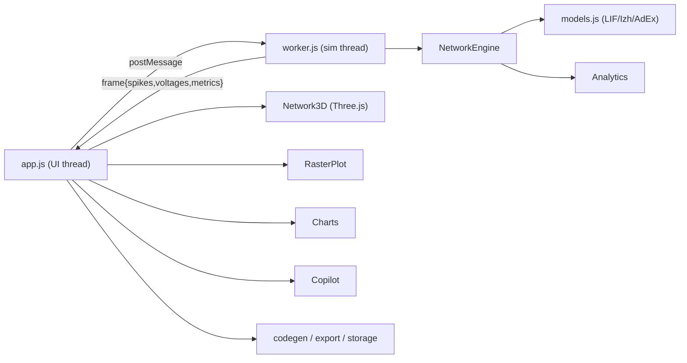

# CortexSim Pro — Architecture

CortexSim Pro is intentionally **zero-build**: plain HTML + ES modules + hand-written CSS, with Three.js loaded through an [import map](https://developer.mozilla.org/docs/Web/HTML/Element/script/type/importmap). This means it deploys to any static host (Vercel, GitHub Pages, S3) with **no compile step**, and every file you read is exactly the file that runs.

## High-level data flow

## Threading model

- **UI thread** (`src/js/ui/app.js`): owns the DOM, controls, Three.js rendering, charts, copilot, and exports. It never runs the numerical integration loop, so the interface stays at 60fps regardless of network size.
- **Simulation thread** (`src/js/engine/worker.js`): a module Web Worker that owns the `NetworkEngine`. It advances the simulation on a timer (`speed` = simulated ms per real second) and posts compact typed-array frames back to the UI.
- Communication is message-passing only; spike ids are sent as `Int32Array` and voltages as `Float32Array` to keep frames small.

## Engine core (`snn-engine.js`)

- **Connectivity** is stored in **CSR (compressed sparse row)** form (`outOffsets`, `outTargets`, `outWeights`) plus a reverse index for STDP. This keeps memory at O(synapses) and makes spike propagation cache-friendly.
- **Delays** are implemented with circular ring buffers (`ringExc` / `ringInh`): a spike deposits conductance into the time-slot `now + delay`.
- **Synapses** are current-based with exponential decay (separate excitatory/inhibitory time constants).
- **Input** is independent Poisson drive per neuron; optional Gaussian noise.
- **Plasticity**: online pair-based STDP using per-neuron pre/post traces, clamped to `[0, wMax]`.
- **Reproducibility**: a single seeded PRNG (`mulberry32`) drives all randomness.

## Models (`models.js`)

Each model exposes `{ defaults, init(state,i,p), step(state,i,p,I,dt,now) }` and returns whether neuron `i` spiked this step. Adding a model = adding one object; the engine and UI pick it up automatically (this is the seam the planned **plugin API** will formalize).

## Analytics (`metrics.js`, `toolbox.js`)

Runs inside the worker so heavy reductions don't block rendering: sliding-window population rate, synchrony χ (Golomb–Rinzel), CV(ISI), and autocorrelation-based dominant-frequency detection. The toolbox adds connectome graph metrics, lesion studies, mutual information, opsin activation curves, and a GCaMP6f calcium proxy.

## Visualization (`viz/`)

- `network3d.js`: a single Three.js `InstancedMesh` for all neurons (one draw call), per-instance color for spike flashes, `OrbitControls`, layout morphing, colorblind palettes, and a WebXR session hook.
- `raster.js` / `charts.js`: lightweight 2D-canvas plots (scrolling raster, voltage trace, population histogram).

## Why not React + Vite + WebGPU + Rust/WASM?

The original brief targeted that stack. We deliberately shipped a **dependency-free core** instead, because:

1. It is **verifiable and runnable today** with no toolchain, and the numerical core is plain functions that are unit-tested in Node.
2. The engine is structured (typed arrays, CSR, pure `step()` functions, worker isolation) so a **WebGPU compute backend or Rust/WASM core can be dropped in behind the same interface** without touching the UI — this is the top roadmap item.

See [`ROADMAP.md`](./ROADMAP.md) for the full implemented-vs-planned breakdown.
